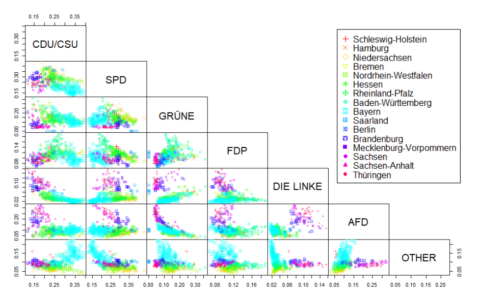

## Overview

Statistical analysis of German Election (2021) results in R. Focus on seeing possible effects of the federal states, including the difference between the new and old federal states. The results show that the former border between West and East Germany remains noticeable in election behaviours. 
- data origin: Statistische Ämter des Bundes und der Länder, Deutschland (2022) https://www.regionalstatistik.de/genesis//online?operation=table&code=14111-01-04-4&bypass=true&levelindex=1&levelid=1649625038484#abreadcrumb
- Univariate analysis: Mean, median, std, quantiles
- Bivariate analysis: Color coded scatter representation
- Multivariate analysis: Clustering with diverse linkage criteria

 All analysis can be found in the script: bundestag_project
 

## Data description and cleaning 

The data is from the federal election on 26.09.2021 and captures the total votes for parties on the constituency, as well as, state and country levels. It further has information on the number of eligible and actual voters, which, however, will, as well as the country and state-level information, not be used in this analysis. 
The variables of this multivariate data set are the major parties and "OTHERS", which are all other parties. The major parties are "CDU/CSU", "SPD", "GRÜNE", "AFD", "DIE LINKE" and "FDP" , which are also the parties who are part of the current parliament (Deutschland.de 2020).
The data set has 400 rows corresponding to individual constituencies and holds the number of votes within a constituency for each party. After cleaning the data from NANs, repeating and unnecessary information, the votes were transformed into probabilities.
Further, the column with a unique number identifer was split from the data and will be used to label the data later by the corresponding state by matching the identifer with the corresponding state.

Each data point is one voting area/constutuencies e.g a city or region (Wahlkreise)

Proportion of voters per party, median indicated by line

## Univariate analysis

## Bivariate analysis

These scatterplots show how the data bheaves when scatter along two axis, in this case percent vote for each party. In this way clustering behaviour can be shown

## Clustering analysis 

Overview of clustering behaviour with different linkage criteria as a dendrogram. I used agglomerative hierarchical clustering, which avoids setting the number of clusters in advance (as e.g k-means requires)

### Average linkage clustering

colorcoding by federal state

Color coded by new (blue) and old (red) federal state

